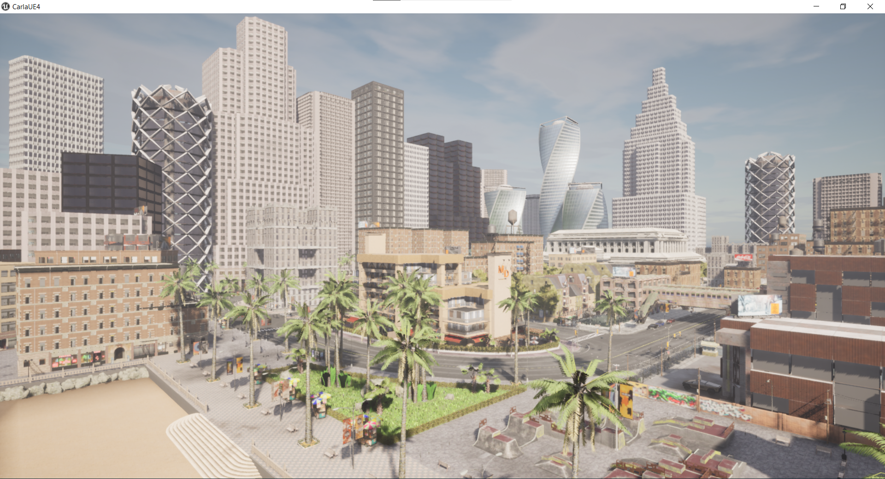
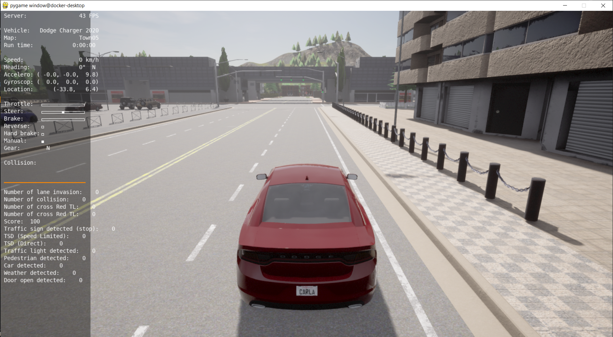
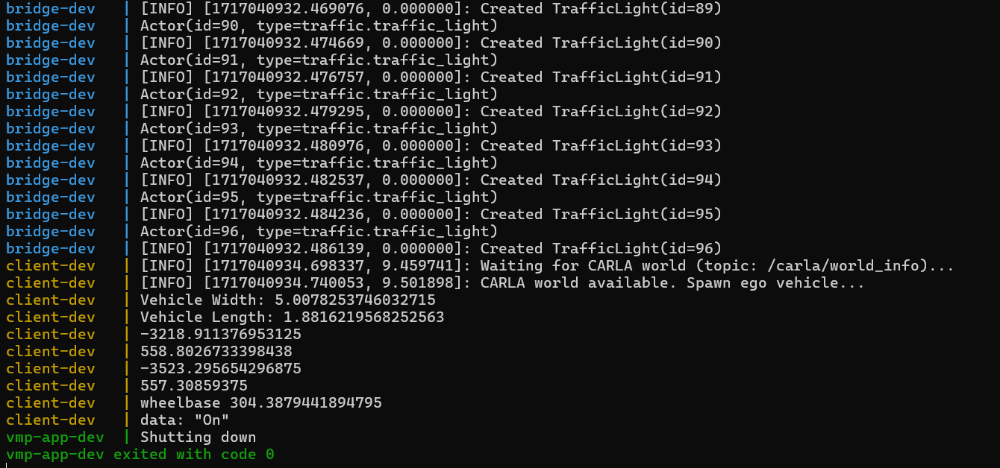

# #Move-Hackathon2024

## 1. Dev Environment Setup

**Prerequisites:** Laptop or PC with *NVIDIA* graphics card

### 1.1. Tested: Windows 10/11 WSL2 Ubuntu-20.04

- [[Windows] CARLA_0.9.13.zip](https://carla-releases.s3.us-east-005.backblazeb2.com/Windows/CARLA_0.9.13.zip)
- Docker Desktop ( tested at v4.27.2 )
- Docker Compose ( tested at v2.24.5 )

### 1.2. Untested: Ubuntu 20.04.6 LTS (Focal Fossa)

> **Note:** To be verified

## 2. Run the Challenge

First, you'll need to pull the base image:

```
docker pull osrf/ros:noetic-desktop-focal
```

Next, clone this Git repository and `cd` into the folder, then

```
docker compose build
```

Now, on your host, you need to launch the CARLA simulator. Inside the downloaded package you should find an executable called `CarlaUE4.exe`:

```
CarlaUE4.exe
```

> **Note:** Launch `CarlaUE4.sh` instead if you're on Ubuntu.

You should see some nice rendering by now. Go on, have fun navigating around by your mouse and keyboard (`W`, `A`, `S`, `D`, `Q`, `E`).



Now, go back to your terminal at this repo, simply call:

```
docker compose up
```

and you shall see the challenge running.



You can drive the car around using the keyboard:
- `Q`: to shift gear
- `W`: to hit the throttle
- `S`: to hit the brake
- `A`: to steer left
- `D`: to steer right
- `Tab`: to change view

> **Note:** If you don't need the first CARLA simulator window, you can run `CarlaUE4.exe -RenderOffScreen` instead, but then don't forget to kill it with Task Manager later.

To gracefully stop and remove all docker containers, open another terminal at this repo and:

```
docker compose down
```

> **Note:** It is also recommended to kill CARLA server every time for a clean start.

## 3. Troubleshooting

### 3.1. Pygame window is not showing

After running `docker compose up`, if you're seeing the log like this:



then you can be confident that everything is working well. However, if the `pygame` window is not showing, then you'll need to install an **X-server** on the Windows host, following this [guide](https://gist.github.com/Mluckydwyer/8df7782b1a6a040e5d01305222149f3c#2-window-server).

> **Note:** You might not need those two `export` commands at the end though.

### 3.2. Pygame window is closed after some keyboard interaction

Make sure you're using an English keyboard layout. :)